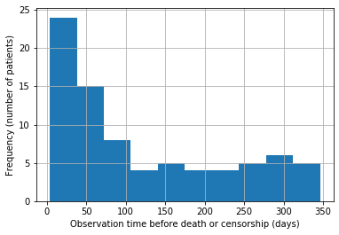
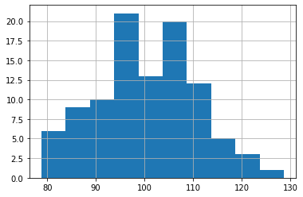
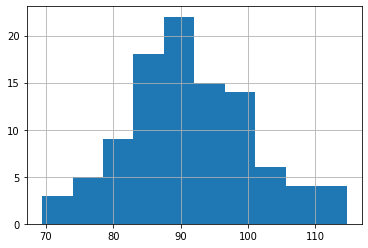
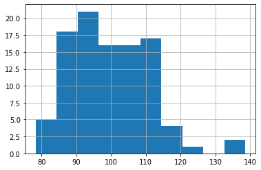

# Course 2 week 1 lecture notebook 01
# Create a Linear Model

## Linear model using scikit-learn

We'll practice using a scikit-learn model for linear regression. You will do something similar in this week's assignment (but with a logistic regression model).

[sklearn.linear_model.LinearRegression()](https://scikit-learn.org/stable/modules/generated/sklearn.linear_model.LinearRegression.html)

First, import `LinearRegression`, which is a Python 'class'.


```python
# Import the module 'LinearRegression' from sklearn
from sklearn.linear_model import LinearRegression
```

Next, use the class to create an object of type LinearRegression.


```python
# Create an object of type LinearRegression
model = LinearRegression()
model
```


    LinearRegression(copy_X=True, fit_intercept=True, n_jobs=None, normalize=False)


Generate some data by importing a module 'load_data', which is implemented for you.  The features in `X' are: 

- Age: (years)
- Systolic_BP: Systolic blood pressure (mmHg)
- Diastolic_BP: Diastolic blood pressure (mmHg)
- Cholesterol: (mg/DL)

The labels in `y` indicate whether the patient has a disease (diabetic retinopathy).
- y = 1 : patient has retinopathy.
- y = 0 : patient does not have retinopathy.


```python
# Import the load_data function from the utils module
from utils import load_data
```


```python
# Generate features and labels using the imported function
X, y = load_data(100)
```

Explore the data by viewing the features and the labels


```python
# View the features
X.head()
```


<div>
<style scoped>
    .dataframe tbody tr th:only-of-type {
        vertical-align: middle;
    }

    .dataframe tbody tr th {
        vertical-align: top;
    }

    .dataframe thead th {
        text-align: right;
    }
</style>
<table border="1" class="dataframe">
  <thead>
    <tr style="text-align: right;">
      <th></th>
      <th>Age</th>
      <th>Systolic_BP</th>
      <th>Diastolic_BP</th>
      <th>Cholesterol</th>
    </tr>
  </thead>
  <tbody>
    <tr>
      <th>0</th>
      <td>77.196340</td>
      <td>78.784208</td>
      <td>87.026569</td>
      <td>82.760275</td>
    </tr>
    <tr>
      <th>1</th>
      <td>63.529850</td>
      <td>105.171676</td>
      <td>83.396113</td>
      <td>80.923284</td>
    </tr>
    <tr>
      <th>2</th>
      <td>69.003986</td>
      <td>117.582259</td>
      <td>91.161966</td>
      <td>92.915422</td>
    </tr>
    <tr>
      <th>3</th>
      <td>82.638210</td>
      <td>94.131208</td>
      <td>69.470423</td>
      <td>95.766098</td>
    </tr>
    <tr>
      <th>4</th>
      <td>78.346286</td>
      <td>105.385186</td>
      <td>87.250583</td>
      <td>120.868124</td>
    </tr>
  </tbody>
</table>
</div>


```python
# Plot a histogram of the Age feature
X['Age'].hist();
```





```python
# Plot a histogram of the systolic blood pressure feature
X['Systolic_BP'].hist();
```





```python
# Plot a histogram of the diastolic blood pressure feature
X['Diastolic_BP'].hist();
```





```python
# Plot a histogram of the cholesterol feature
X['Cholesterol'].hist();
```





Also take a look at the labels


```python
# View a few values of the labels
y.head()
```


    0    0.0
    1    0.0
    2    1.0
    3    1.0
    4    1.0
    Name: y, dtype: float64


```python
# Plot a histogram of the labels
y.hist();
```


Fit the LinearRegression using the features in `X` and the labels in `y`.  To "fit" the model is another way of saying that we are training the model on the data.


```python
# Fit the linear regression model
model.fit(X, y)
model
```


    LinearRegression(copy_X=True, fit_intercept=True, n_jobs=None, normalize=False)


- View the coefficients of the trained model.
- The coefficients are the 'weights' or $\beta$s associated with each feature
- You'll use the coefficients for making predictions.
$$\hat{y} = \beta_1x_1 + \beta_2x_2 + ... \beta_N x_N$$


```python
# View the coefficients of the model
model.coef_
```


    array([0.00975155, 0.00835816, 0.00836864, 0.00971064])


In the assignment, you will do something similar, but using a logistic regression, so that the output of the prediction will be bounded between 0 and 1.

### This is the end of this practice section.

Please continue on with the lecture videos!

---
